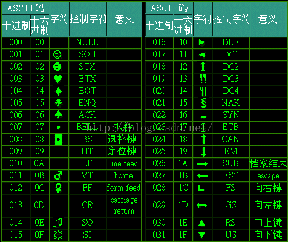
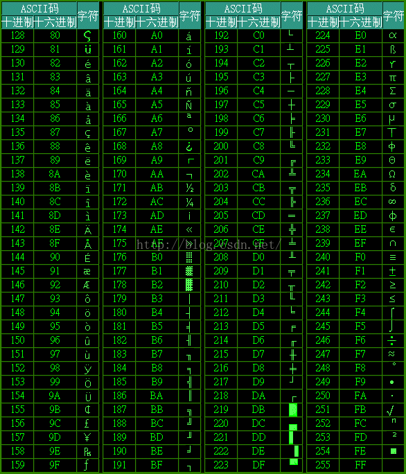
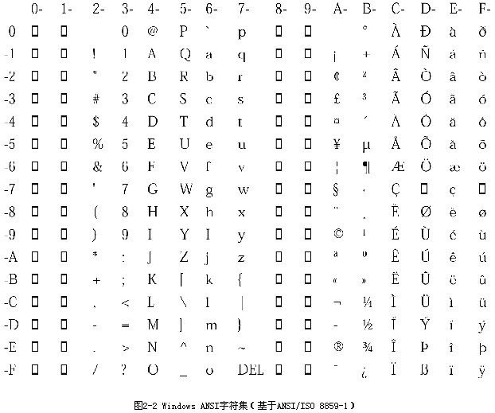

## ES6 备忘录

## 1. 由块级作用域引出的一场变革

1、块级作用域又称词法作用域，存在于：

* 函数内部（函数作用域）
* 块中（字符 { 和 } 之间的区域）

<b style="color: #c03546">注意：ES6允许块级作用域任意嵌套</b>

```
{{{{{{let text = 'Hello World!'}}}}}}
```

### 1.1 块级声明

块级声明是用于声明在指定块的作用域之外无法访问的变量。

### 1.2 let声明：用来声明一个块级作用域变量

1. 声明的变量具有块级作用域的特性

```
// 例子
function getValue (condition) {
    if (condition) {
        let value = 'blue';
        return value;
    }
    console.log(value)
    // 报错 value is not defined
}
getValue()
```

2. 在同一个作用域内不能使用let声明同名的变量

```
// 不管是var,const或者let,新的let声明之前同名的变量，都会报错
var count = 30;
let count = 40;
// 报错 Identifier 'count' has already been declared

// 函数形参和函数内部的let声明变量重名，报错
function test(value) {
    let value = 3;
}
test()
// 报错 Identifier 'value' has already been declared

// 在不同的作用域声明的变量重名是没问题的
let count = 30;
if(true) {
  let count = 40;
  // 不同的作用域，不会报错
}

```

3. 声明没有预解析，不存在变量提升，有“临时死区”(TDZ)

从块的开始到变量声明这段的区域被称为临时死区，ES6明确规定，如果区块中存在let和const命令，则这个区块对这些命令声明的变量从一开始就形成封闭作用域，只要在声明之前就使用这些变量（赋值，引用等等），就会报错。

```
if(true) {
    console.log(typeof value);
    // 报错 value is not defined

    let value = 'blue';
}
```

<b style="color: #c03546">注意：TDZ是区域是“块开始”到“变量声明”，下面的例子不报错</b>

```
// typeof 说是相对安全，确实是，永远拿不到想要的结果
console.log(typeof value); // 打印 undefined，没有报错
if(true) {
    let value = 'red';
}
```

### 1.3 const声明：声明常量（如PI），值一旦被设定后不可更改

1. 常量声明的值是不可变的

<b style="color: #c03546">注意：const声明的对象不允许修改绑定，但可以修改该对象的属性值。</b>

```
const number = 6;
number = 5;
// 报错 Assignment to constant variable

const obj = {number: 1};
obj.number = 2; // 不报错

obj = {number: 3};
// 报错 Assignment to constant variable
```

2. 因为常量声明后值就不可更改了，所以声明时必须赋值

```
// 有效的常量
const count = 30;

// 报错 Missing initializer in const declaration
const name;
```

3. 声明的常量具有块级作用域的特性

```
if(true) {
    const number = 5;
}
console.log(number)
// 报错 number is not defined
```

4. 在同一个作用域内不能使用const声明同名的变量

```
var message = 'Hello';
let age = 25;

// 这两条语句都会报错
const message = 'Good';
const age = 30;
```

5. 声明没有预解析，不存在变量提升，有“临时死区”(TDZ)

<br>

<b style="color: #00dffc;">总结：一张表格</b>

| 声明方式 | 变量提升 | 作用域 | 是否需要初始值 | 重复定义 |
| ----- | --- | --- | ------ | --- |
| var | 是 | 函数级 | 不需要 | 允许 |
| let | 否 | 块级 | 不需要 | 不允许 |
| const | 否 | 块级 | 需要 | 不允许 |

<b style="color: #fc913a;">扩展：再提一下变量命名，不管是var、let、const声明的变量名，可以由数字，字母，下划线及美元符号组成，但是不能以数字开头。美元符号可以放到任何一个位置，甚至单独一个美元符号。</b>


### 1.4 循环中的块作用域绑定

> 循环中的let声明

```
// 第一个对比
// before
for(var i = 0; i < 5; i++) {
    // ... 省略一些代码
}
console.log(i)  // 5

//after
for(let i = 0; i < 5; i++) {
    // ... 省略一些代码
}
console.log(i) // 报错 i is not defined


// 第二个对比
// before
var funcs = [];
for(var i = 0; i < 10; i++) {
    funcs.push(() => {console.log(i)})
}
funcs.forEach((ele) => {
	ele()
})
// 打印 10次 10

// after
var funcs = [];
for(let i = 0; i < 10; i++) {
    funcs.push(() => {console.log(i)})
}
funcs.forEach((ele) => {
	ele()
})
// 打印 0 1 2 3 4 5 6 7 8 9
```

<b style="color: #c03546">注意：有一点很重要，let 声明在循环内部的行为是标准中专门定义的，它不一定与 let 不提升特性有关。</b>

> 循环中的const声明

```
// for 循环会报错
for (const i = 0; i < 1; i++) {
    console.log(i)
}
// 打印 0 ，然后报错 Assignment to constant variable.

// for-in 和 for-of 不会报错
var object = {
    a: true,
    b: true,
    c: true
};
for (const key in object) {
    // 不要在循环体内更改key的值，会报错
    console.log(key)
}
// 打印 a b c
```
<b style="color: #c03546">注意：const可以应用在 for-in 和 for-of 循环中，是因为每次迭代不会修改已有绑定，而是会创建一个新绑定。</b>

### 1.5 块级绑定最佳实践的进化

> ES6 早期

普遍认为默认使用let来替代var,对于写保护的变量使用const

> ES6 使用中

普遍默认使用const，只有确实需要改变变量的值时使用let。因为大部分变量的值在初始化后不应再改变，而预料之外的变量值的改变是许多bug的源头。这样就可以在某种程度上实现代码的不可变，从而防止某些错误的发生。


### 1.5 全局变量将逐步与顶层对象的属性脱钩

顶层对象，在浏览器环境指的是window对象，在Node指的是global对象。

为了保持兼容性，var命令和function命令声明的全局变量，依旧是顶层对象的属性；
```
var a = 1;
window.a // 1
```


另一方面规定，let命令、const命令、class命令声明的全局变量，不属于顶层对象的属性。


上图可见let 声明的变量，并没有在Window对象里，而是一个新的Script对象。

<b style="color: #fc913a;">扩展：如果需要在浏览器中跨frame或window访问代码，仍然可以用var在全局对象下定义变量。</b>


### 1.6 块级函数

从ECMAScript 6开始，在严格模式下，块里的函数作用域为这个块。ECMAScript 6之前不建议块级函数在严格模式下使用。

```
'use strict';

function f() {
  return 1;
}

{
  function f() {
    return 2;
  }
}

f() === 1; // true

// f() === 2 在非严格模式下相等
```

<b style="color: #c03546">注意：在非严格模式下不要用块级函数，因为在非严格模式下，块中函数的声明表现奇怪，有兼容性风险</b>

```
if (shouldDefineZero) {
   function zero() {     // DANGER: 兼容性风险
      console.log("This is zero.");
   }
}
```

ECMAScript 6中，如果shouldDefineZero是false，则永远不会定义zero,因为这个块不执行。这是新标准定义的。然而，这里存在历史遗留问题，无论这个块是否执行，一些浏览器会定义zero。

在严格模式下，所有支持ECMAScript 6的浏览器以相同的方式处理：只有在shouldDefineZero为true的情况下定义zero，并且作用域只是这个块内。

## 2、字符相关的变化

计算机内部处理的信息，都是一个些二进制值，每一个二进制位（bit）有0和1两种状态。
一个字节（byte）有八个二进制位，也就是说，一个字节一共可以用来表示256种不同的状态，每一个状态对应一个符号，就是256个符号，从`00000000`到`11111111`。转换成十六进制，一个字节就是`0x00`到`OxFF`。


### 2.1 先来聊聊字符编码的历程


#### （1） ASCII 码

上个世纪60年代，美国制定了一套字符编码，对英语字符与二进制位之间的关系，做了统一规定。这被称为 ASCII 码(美国信息交换标准代码)，一直沿用至今。

ASCII 码一共规定了128个字符的编码,只占用了一个字节的后面7位，最前面的一位统一规定为0。

第一部分：0～31（0x00~0x1F）及127(共33个)是控制字符或通信专用字符,有些可以显示在屏幕上,有些则不能显示,但能看到其效果(如换行、退格)如下表:



第二部分：是由20~7E共95个,这95个字符是用来表示阿拉伯数字、英文字母大小写和下划线、括号等符号,都可以显示在屏幕上如下表:


#### (2) 非ASCII 编码

英语用128个符号编码就够了，但是世界上可不只有英语这一种语言，先不说汉语，就是那些不说英语的欧洲国家，128个符号是不够的。

一些欧洲国家就决定，利用字节中闲置的最高位编入新的符号，这些欧洲国家使用的编码体系，可以表示最多256个符号。大家你加你的，我加我的。因此，哪怕它们都使用256个符号的编码方式，代表的字母却不一样。

1981年IBM PC ROM256个字符的字符集，即IBM扩展字符集，这128个扩充字符是由IBM制定的,并非标准的ASCII码.这些字符是用来表示框线、音标和其它欧洲非英语系的字母。如下图：



在Windows 1.0（1985年11月发行）中，Microsoft没有完全放弃IBM扩展字符集，但它已退居第二重要位置。因为遵循了ANSI草案和ISO标准，纯Windows字符集被称作「ANSI字符集」。



由此可见扩展ASCII不再是国际标准。

而对于亚洲国家的文字，使用的符号就更多了，汉字就多达10万左右。一个字节只能表示256种符号，肯定是不够的，就必须使用多个字节表达一个符号。比如，简体中文常见的编码方式是 GB2312(中华人民共和国国家标准简体中文字符集)，使用两个字节表示一个汉字，所以理论上最多可以表示 256 x 256 = 65536 个符号。但其实并不是。


#### (3) Unicode

之前的编码，大家在自己的国家使用都挺好的。世界上存在着多种编码方式，同一个二进制数字可以被解释成不同的符号，所以一旦不同国家进行数据传输，结果就只有乱码了。

如果有一种编码，将世界上所有的符号都纳入其中。每一个符号都给予一个独一无二的编码，那么乱码问题就会消失。这就是 Unicode，就像它的名字都表示的，这是一种所有符号的编码。

Unicode，定义很简单，用一个码点(code point)映射一个字符。码点值的范围是从U+0000到U+10FFFF，可以表示超过110万个符号。

Unicode 最新版本的是 11.0，总共137,374个字符，这么看来，还是挺够用的。

Unicode最前面的65536个字符位，称为基本平面（BMP-—Basic Multilingual Plane），它的码点范围是从U+0000到U+FFFF。最常见的字符都放在这个平面，这是Unicode最先定义和公布的一个平面。
剩下的字符都放在补充平面（Supplementary Plane），码点范围从U+010000一直到U+10FFFF，共16个。

**需要注意的是，Unicode 只是一个符号集，它只规定了符号的二进制代码，却没有规定这个二进制代码应该如何存储。**

正式因为上面说的，没有规定怎么存储，所以出现了Unicode 的多种存储方式，不同的实现导致了Unicode 在很长一段时间内无法推广，而且本来英文字母只用一个字节存储就够了，如果 Unicode 统一规定，每个符号用三个或四个字节表示，那么每个英文字母前都必然有二到三个字节是0，这对于存储来说是极大的浪费，文本文件的大小会因此大出二三倍，这是无法接受的。

在这个时候往往需要一个强大的外力推送，大家诉诸于利益，共同实现一个目标。所以，万维网普及了，地球变成了村子，交流越来越多，乱码是怎么能行。

#### (4) UTF-8、UTF-16、UTF-32

上面三种都是 Unicode 的实现方式之一。 UTF-16（字符用两个字节或四个字节表示）和 UTF-32（字符用四个字节表示），不过UTF-8 是在互联网上使用最广的一种 Unicode 的实现方式。


> UTF-8

UTF-8 是一种变长的编码方式。它可以使用1~4个字节表示一个符号，根据不同的符号而变化字节长度。越是常用的字符，字节越短，最前面的128个字符，只使用1个字节表示，与ASCII码完全相同（也就是所说的兼容ASCII码）。这样就比UTF-16 和 UTF-32节省空间。

UTF-8 的编码规则很简单，只有二条：

1）对于单字节的符号，字节的第一位设为0，后面7位为这个符号的 Unicode 码。因此对于英语字母，UTF-8 编码和 ASCII 码是相同的。

2）对于n字节的符号（n > 1），第一个字节的前n位都设为1，第n + 1位设为0，后面字节的前两位一律设为10。剩下的没有提及的二进制位，全部为这个符号的 Unicode 码。


> UTF-16

基本平面的字符占用2个字节，辅助平面的字符占用4个字节。也就是说，UTF-16的编码长度要么是2个字节（U+0000到U+FFFF），要么是4个字节（U+010000到U+10FFFF）。

UTF-16编码介于UTF-32与UTF-8之间，同时结合了定长和变长两种编码方法的特点。

> UTF-32

UTF-32 最直观的编码方法，每个码点使用四个字节表示，字节内容一一对应码点。

UTF-32的优点在于，转换规则简单直观，查找效率高。缺点在于浪费空间，同样内容的英语文本，它会比ASCII编码大四倍。这个缺点很致命，导致实际上没有人使用这种编码方法，HTML 5标准就明文规定，网页不得编码成UTF-32。

#### (5) UCS UCS-2

UCS团队是1989年成立的，想要做统一字符集，当然另一个想做统一字符集的是1988年成立的Unicode团队，等到他们发现了对方的存在，很快就达成一致：世界上不需要两套统一字符集（幸亏知道的早啊）。

1991年10月，两个团队决定合并字符集。也就是说，从今以后只发布一套字符集，就是Unicode，并且修订此前发布的字符集，UCS的码点将与Unicode完全一致。

UCS的开发进度快于Unicode，1990年就公布了第一套编码方法UCS-2，使用2个字节表示已经有码点的字符。（那个时候只有一个平面，就是基本平面，所以2个字节就够用了。）UTF-16编码迟至1996年7月才公布，明确宣布是UCS-2的超集，即基本平面字符沿用UCS-2编码，辅助平面字符定义了4个字节的表示方法。

两者的关系简单说，就是UTF-16取代了UCS-2，或者说UCS-2整合进了UTF-16。所以，现在只有UTF-16，没有UCS-2。

UCS-2 使用2个字节表示已经有码点的字符,第一个字节在前，就是"大头方式"（Big endian），第二个字节在前就是"小头方式"（Little endian）。

那么很自然的，就会出现一个问题：计算机怎么知道某一个文件到底采用哪一种方式编码？

Unicode 规范定义，每一个文件的最前面分别加入一个表示编码顺序的字符，这个字符的名字叫做"零宽度非换行空格"（zero width no-break space），用FEFF表示。这正好是两个字节，而且FF比FE大1。

如果一个文本文件的头两个字节是FE FF，就表示该文件采用大头方式；如果头两个字节是FF FE，就表示该文件采用小头方式。

### 2.2 JavaScript 编码方法存在的问题


