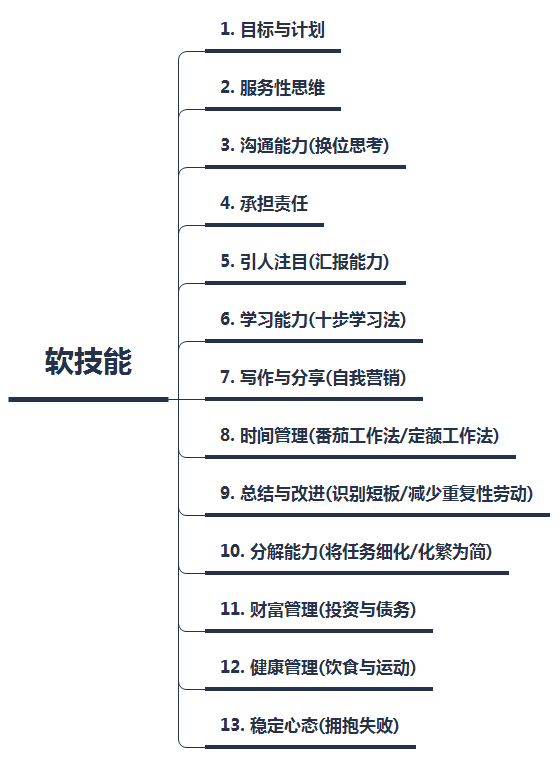
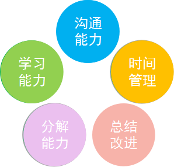
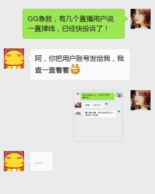
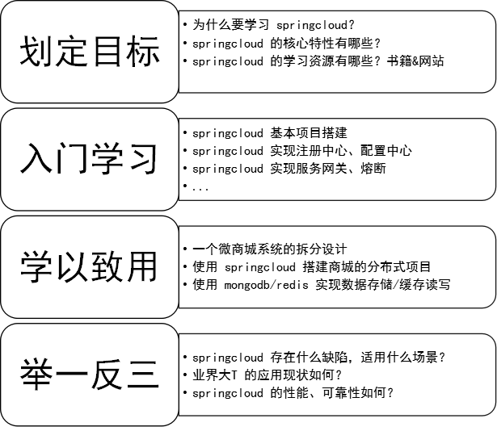
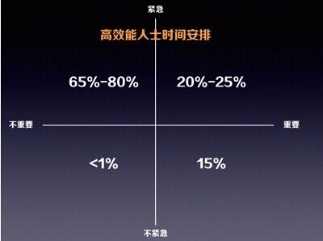
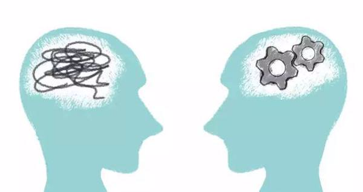
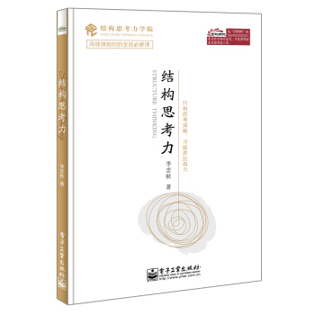
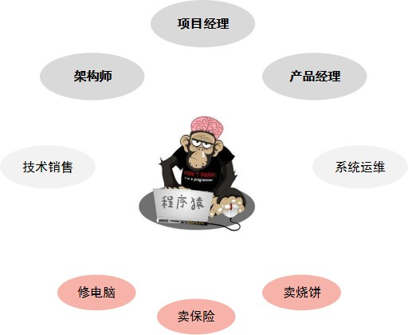
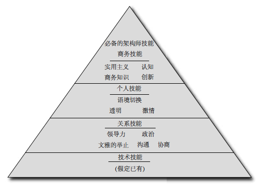
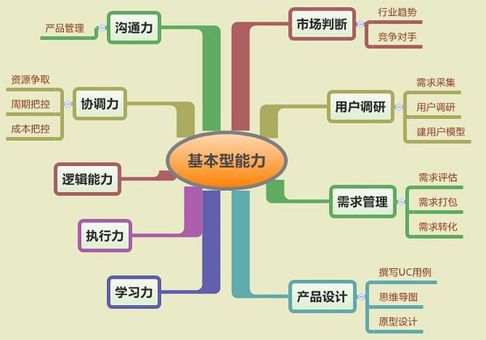

# 软能力

#### [原文链接](https://www.cnblogs.com/littleatp/p/9653019.html)

> 在我们日常工作中，常常会听到软能力这一个词汇，尤其是在称赞某个人工作表现不错的时候更是如此。  
> 然而关于软能力是什么，一百个人有一百种解释，就好像一千个人有一千个哈姆雷特。

一、软能力是什么
--------

什么是软能力？回答这个问题之前，我们先要了解什么是硬能力。

    还记得曾经如火如荼的高考吗，大家都是卯足了劲儿，挑灯夜读，为的就是上一所心仪的大学。

在应试教育的背景下，考试能力、学习成绩这些就是你的硬能力。

    金庸小说里，第一次华山论剑，南帝北丐展一阳指、降龙十八掌之绝技，东邪西毒现弹指神通、蛤蟆功之怪诞武艺，最终由中神通王重阳战胜群雄，获得天下第一。

在武侠小说里，武功的高低是你的硬能力。

**硬能力**往往最容易被记住，而且人们也更乐于就某个人物(或事物)的硬能力进行谈论

为什么？因为相对于软能力来说，硬能力更加简单，更容易被描述。

那么，软能力究竟应该对应什么？

在高考评估体系里面，占比重最大的无非是笔试成绩，而一些实用型能力比如沟通能力、组织协调能力却没能被考虑进去(这是国内应试教育一直被诟病的地方)，  
它们是组成软能力的重要部分。

再看看华山论剑的案例，武功再高，如果品行败坏，坏事做尽，是很难获得后人世颂的。  
这时，武德便是一种软能力。另外，如果武艺高强却没有人知道，就是隐姓埋名；说不中听的，那就是废柴一个。

这时候，名号的传播就很重要了，我们知道，大约宋代开始，有一种说书人，其常年以演说卖艺为生。  
在现如今，这便是隐形的营销。

有人说，在当今的世界上，硬能力就是智商，软能力则是情商；  
也有人说，在企业里面，硬能力是满足岗位需求的必要技能，软能力是你与团队进行交互协作的能力。

我觉得，说的都对！  
软能力是能够让你变得优秀的关键能力。

二、软能力-程序猿生存指南
-------------

让我们回到 软件开发 这个行当，当你即将成为一名程序猿，或者你已经作为程序猿好多年了之后，你是否清楚：

作为一名程序猿，应该至少具备什么样的软能力，才能使你从猿猿众生中脱颖而出。

在《软技能-代码之外的生存指南》一书中，作者约翰 Z. 森梅兹为以自己的经历为例，为我们仔细讲述了程序员除了写代码之外应该具备的各种软能力，  
值得一提的是，该作者还是一名出色的健身爱好者及投资客，这可能是令许多人望尘莫及的。

**摘序**

    作为一个软件开发人员，在我的生活中，我经历过许多不同的旅程。
    我曾走在阳关大道，也曾误入歧途，还有一些路我至今仍不知是对还是错。
    这一路走来，我并没有得到太多的帮助和指导。
    我从来没觉得有谁为我披荆斩棘，开辟出一条小路使我可以因循，
    也从来没觉得有谁可以告诉我如何成为一名最成功的软件开发人员——
    不能只编写代码，还要有精彩的人生。

在阅读完此书后，我将所能记住的软能力归纳如下：

好了，有点多.. 有了这些技能，相信大部分程序猿就能迎娶白富美，走上人生巅峰了吧！

为了简化理解，我们可以将关注点聚焦到下面几个维度上：

接下来解读一下

### A. 沟通能力

关于沟通方面的能力是老生常谈了，沟通表达能力强的程序猿总是不一样，  
在很多场景下都会占优：

*   小组选拔带头人
*   出差到客户现场露露脸
*   介绍对象  
    ...

沟通好的人有一点很关键的是换位思考能力，就是能为沟通的对象着想，让你感觉很舒服。  
下面有个案例：

### B. 学习能力

学习要有方法，才能取得更高的效率及更好的效果。  
在《软技能-代码之外的生存指南》一书中提到的 "十步学习法" 如下：

    第一步：了解全局
    第二步：确定范围
    第三步：定义目标
    第四步：寻找资源
    第五步：创建学习计划
    第六步：筛选资源
    第七步：开始学习，浅尝辄止
    第八步：动手操作，边玩边学
    第九步：全面学习，学以致用
    第十步：乐为人师，融会贯通

十步学习法看似有些繁琐，其实却很有逻辑性，是一个循序渐进的过程。  
经过归纳后，我们当然可以做一些简化。

这里以学习**spring cloud**为例，整个过程如下：

当然，关于学习过程，你可以自己归纳，但不应该是没有章法的。

### C. 时间管理

时间管理，在职场上更多的是工作管理，即**如何有条不紊的将工作逐个完成**，  
既要满足上级，也要让自己不纠结后悔。

许多关于时间管理的书籍都会提到**番茄工作法**

**如下**

    按照 番茄钟 的方式对工作任务进行拆解排序；
    每个番茄钟对应一段25分钟的工作时间；
    在每个番茄钟内部不允许有新任务插入，此时只需要将任务放到待办事项；
    每个番茄钟结束后，进行5分钟的休息调整，之后进行下一个番茄钟

在进行事务排序时，推荐使用**四象限法**

番茄工作法是不错的，但并不完美，许多人尽管知道但却很做到极致。  
比如：

*   很难将任务优先级进行排序，万一错了呢？
*   很难将任务对应到25分钟内，我其实需要1个小时..
*   很难拒绝新来的任务啊，面对主管的催促，运营MM的询问，实在纠结

针对这些问题，你只能先承受着..，然后不断去尝试优化

> 李笑来在《和时间做朋友》专栏中提出一个观点：**时间是不可管理的！**

> 这说的倒是没错，我们其实都是时间的奴隶(尽管有些消极)。  
> 所以，需要知道失控是一种常态，以一种平稳的心态去看待。  
> 在过程中去找到你真实的现状和能力，持续探索属于自己的控制方式。

### D. 分解能力

分解能力几乎是各个领域里最通用的能力了。  
这个世界是结构化的，大到一个庞大的帝国，小到一只蝼蚁，都是由结构组成的。  
就连本文都有一个相对不那么模糊的提纲结构。

在软件世界里也一直推崇**分而治之**的思想。  
技术人只有具备了良好的结构思考力，在应付一个庞大的项目时才能显得得心应手。

至于这种**先总后分** 的结构化思维方式，也是一直传承以久的。

这里推荐一本书籍，叫《结构化思考力》，作者李忠秋是专注于该领域的专家。  
将这部书多读两遍，相信会有所收获。

### E. 总结改进

总结归纳是一种能力，但更应该成为一种习惯。  
总结的目的是为了改进，刷新自我。

在《高效人士的七个习惯》中，第七条就是

**“不断更新 平衡的自我更新原则”**

有不少企业将总结改进作为团队管理的核心要领之一，在敏捷化项目管理中，迭代回顾也是重要形式之一。  
但是呢，对于大部分程序猿个人来说，做总结改进可能有些痛苦。

    “有那么多时间做总结，还不如多敲点代码！”

以上，如果代表了你的心声，那么很遗憾，这只是你给自己找的**关于不愿意进步**的一个借口。

三、程序猿成长路线
---------

> 软能力在程序猿的成长中其实扮演了至关重要的角色，但往往只是不被察觉

通常，一名程序猿的发展道路有许多种，如下图所示：

其中，架构师、项目经理、产品经理是出镜率最高的，大多只要是不跨行的程序猿，几乎最后都是如此。  
而对于我而言，这几个角色又是特别熟悉不过的。

> 问题：软能力于这些角色又有什么样的关系？

### 1\. 架构师

微服务架构很火，架构师的职位也很火，程序猿看到**架构师 21天 快速进阶**的字眼也很兴奋...

然而比较遗憾的是，许多关于架构师的培训、书籍都是以**架构技术**为主，  
认为架构师就是技术牛B就好，对于架构师的软能力一概不谈。

一些初创型的公司中，创始人并不真正了解架构师，却执着于招聘架构师岗位，素不知道他只是需要一个高级码农就可以了..

下面这个图来自《软件架构师的12项修炼》一书，很好的说明了架构师该具备的软技能。

see? 技术能力只是最基础的部分，沟通、领导力、认知、创新等等却是属于更高阶的能力。

### 2\. 项目经理

项目经理是一种纯管理类的岗位，在大部分中小型公司里，项目经理更多扮演了一个"打杂"的角色。  
为什么？ 我们先来看看项目经理的担子有多重：

**目标管理**  
要团队的每个人都能理解目标，非强大的沟通能力不可。

**进度管理**  
天天早会，天天监工，烦不胜烦..

**成本管理**  
至少有一点成本预算意识(投资意识)，小心老板对你不满！

**人员管理**  
有些人不想干了，得找他谈谈心，或许还有挽留的机会..

**风险管理**  
总是提心吊胆，得有强大的心理素质

...

也确实，好的项目经理身上总是聚集了许多高超的软能力，然而并不是很多程序猿都想当项目经理。  
一般来说，没有技术情结或技术不到家的，想快速上位的，可以走这个路线。

### 3\. 产品经理

程序猿转型产品经理的案例现在也越来越多了，  
这说明什么？ 互联网渗透率在加速的涨，产品经理待遇也在涨..

具备技术背景的产品经理无疑是有优势的，但只是要小心，不要掉进**技术情结的怪圈**

对于胜任产品经理一事的能力诉求，我认为下面的一张图可以很好说明：

【图来自豆瓣：[https://www.douban.com/note/321706416/](https://www.douban.com/note/321706416/)】

在上面的图示中，沟通协调能力、逻辑分析、学习能力等等都在前面篇幅中提及。  
可见，在转型产品经理一职之前，程序猿要升华的部分仍然是不少！

四、小结
----

笔者在接触软件工作的这些年间，接触过不少程序猿，大部分人天资聪慧，热情助人，以拯救大家为己任。  
但是在面临职业生涯瓶颈转折之时，往往会产生许多纠结。  
技术出众者往往孤傲，不善于合群；技术平平者，往往能说会道，职场之路畅行无阻！

在大部分情况下，软能力是获得成功的关键，本文介绍了一些模型，希望对读者能产生一些启示。  
谨以此文，献给仍然在挣扎中奋斗的技术人！